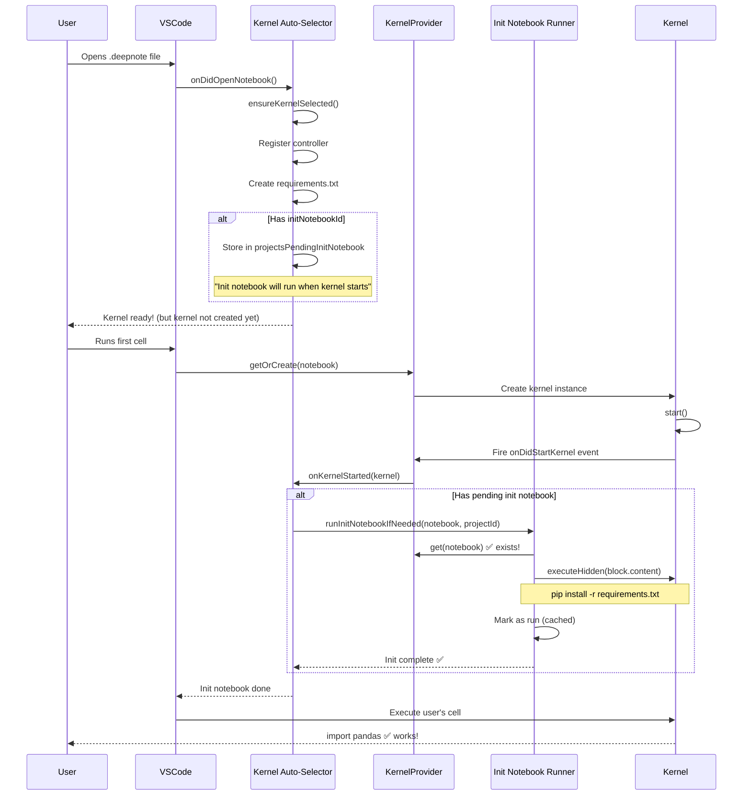

# Deepnote Kernel Auto-Start Implementation

## Overview

This implementation adds automatic kernel selection and startup for `.deepnote` notebook files. When a user opens and runs cells in a `.deepnote` file, the extension will:

1. Automatically detect the file type
2. Install the `deepnote-toolkit` Python package (if not already installed)
3. Start a Jupyter server using `deepnote-toolkit`
4. Create and auto-select a Deepnote kernel controller
5. Execute cells on the Deepnote kernel

## Architecture

### Components Created

#### 1. **Deepnote Kernel Types** (`src/kernels/deepnote/types.ts`)

- `DeepnoteKernelConnectionMetadata`: Connection metadata for Deepnote kernels (similar to RemoteKernelSpecConnectionMetadata)
- `IDeepnoteToolkitInstaller`: Interface for toolkit installation service
- `IDeepnoteServerStarter`: Interface for server management
- `IDeepnoteKernelAutoSelector`: Interface for automatic kernel selection
- `DeepnoteServerInfo`: Server connection information (URL, port, token)
- Constants for wheel URL, default port, and notebook type

#### 2. **Deepnote Toolkit Installer** (`src/kernels/deepnote/deepnoteToolkitInstaller.node.ts`)

- Creates a dedicated virtual environment per `.deepnote` file
- **Upgrades pip** in the venv to the latest version (ensures latest pip features and fixes)
- Checks if `deepnote-toolkit` is installed in the venv
- Installs the toolkit and `ipykernel` from the hardcoded S3 wheel URL
- Installs ipykernel in the venv to enable kernel functionality
- Outputs installation progress to the output channel
- Verifies successful installation
- Reuses existing venvs for the same `.deepnote` file

**Key Methods:**

- `getVenvInterpreter(deepnoteFileUri)`: Gets the venv Python interpreter for a specific file
- `ensureInstalled(interpreter, deepnoteFileUri)`: Creates venv, installs toolkit and ipykernel
- `getVenvHash(deepnoteFileUri)`: Creates a unique hash for venv directory paths
- `getDisplayName(deepnoteFileUri)`: Gets a friendly display name for the kernel

#### 3. **Deepnote Server Starter** (`src/kernels/deepnote/deepnoteServerStarter.node.ts`)

- Manages the lifecycle of deepnote-toolkit Jupyter servers (one per `.deepnote` file)
- Finds an available port (starting from 8888)
- Starts the server with `python -m deepnote_toolkit server --jupyter-port <port>`
- **Sets environment variables** so shell commands use the venv's Python:
  - Prepends venv's bin directory to `PATH`
  - Sets `VIRTUAL_ENV` to the venv path
  - Removes `PYTHONHOME` to avoid conflicts
- Monitors server output and logs it
- Waits for server to be ready before returning connection info
- Reuses existing server for the same `.deepnote` file if already running
- Manages multiple servers for different `.deepnote` files simultaneously

**Key Methods:**

- `getOrStartServer(interpreter, deepnoteFileUri)`: Returns server info for a file, starting if needed
- `stopServer(deepnoteFileUri)`: Stops the running server for a specific file
- `isServerRunning(serverInfo)`: Checks if server is responsive

#### 4. **Deepnote Server Provider** (`src/kernels/deepnote/deepnoteServerProvider.node.ts`)

- Jupyter server provider that registers and resolves Deepnote toolkit servers
- Implements `JupyterServerProvider` interface from VSCode Jupyter API
- Maintains a map of server handles to server connection information
- Allows the kernel infrastructure to resolve server connections

**Key Methods:**

- `activate()`: Registers the server provider with the Jupyter server provider registry
- `registerServer(handle, serverInfo)`: Registers a Deepnote server for a specific handle
- `provideJupyterServers(token)`: Lists all registered Deepnote servers
- `resolveJupyterServer(server, token)`: Resolves server connection info by handle

#### 5. **Deepnote Init Notebook Runner** (`src/notebooks/deepnote/deepnoteInitNotebookRunner.node.ts`)

- Runs initialization notebooks automatically before user code executes
- Checks for `project.initNotebookId` in the Deepnote project YAML
- Executes init notebook code blocks sequentially in the kernel
- Shows progress notification to user
- Caches execution per project (runs only once per session)
- Logs errors but allows user to continue on failure
- Blocks user cell execution until init notebook completes

**Key Methods:**

- `runInitNotebookIfNeeded(projectId, notebook)`: Main entry point, checks cache and executes if needed
- `executeInitNotebook(notebook, initNotebook)`: Executes all code blocks from init notebook

#### 6. **Deepnote Requirements Helper** (`src/notebooks/deepnote/deepnoteRequirementsHelper.node.ts`)

- Static helper class for creating `requirements.txt` from project settings
- Extracts `project.settings.requirements` array from Deepnote YAML
- Creates `requirements.txt` in workspace root before init notebook runs
- Ensures dependencies are available for pip installation in init notebook

**Key Methods:**

- `createRequirementsFile(project)`: Creates requirements.txt from project settings

#### 7. **Deepnote Kernel Auto-Selector** (`src/notebooks/deepnote/deepnoteKernelAutoSelector.node.ts`)

- Activation service that listens for notebook open events and controller selection changes
- Automatically selects Deepnote kernel for `.deepnote` files
- Queries the Deepnote server for available kernel specs using **matching hash function**
- **Selects a server-native Python kernel spec** (e.g., `deepnote-venv-{hash}` or fallback to any available Python kernel)
- The Deepnote server is started with the venv's Python interpreter, ensuring the kernel uses the venv environment
- Environment variables (`PATH`, `VIRTUAL_ENV`, `JUPYTER_PATH`) are configured so the server and kernel use the venv's Python
- Registers the server with the server provider
- Creates kernel connection metadata
- Registers the controller with VSCode
- Auto-selects the kernel for the notebook
- **Reuses existing controllers and servers** for persistent kernel sessions
- **Automatically reselects kernel** if it becomes unselected after errors
- Tracks controllers per notebook file for efficient reuse
- **Coordinates init notebook execution** via event-driven approach

**Key Methods:**

- `activate()`: Registers event listeners for notebook open/close, controller selection changes, and kernel starts
- `ensureKernelSelected(notebook)`: Main logic for auto-selection, kernel spec selection, kernel reuse, and init notebook preparation
- `onDidOpenNotebook(notebook)`: Event handler for notebook opens
- `onControllerSelectionChanged(event)`: Event handler for controller selection changes (auto-reselects if needed)
- `onDidCloseNotebook(notebook)`: Event handler for notebook closes (preserves controllers for reuse)
- `onKernelStarted(kernel)`: Event handler for kernel starts (triggers init notebook execution)
- `getVenvHash(fileUri)`: Creates consistent hash for kernel spec naming (must match installer)

#### 8. **Service Registry Updates** (`src/notebooks/serviceRegistry.node.ts`)

- Registers all new Deepnote kernel services
- Binds `DeepnoteServerProvider` as an activation service
- Binds `IDeepnoteKernelAutoSelector` as an activation service

#### 9. **Kernel Types Updates** (`src/kernels/types.ts`)

- Adds `DeepnoteKernelConnectionMetadata` to `RemoteKernelConnectionMetadata` union type
- Adds deserialization support for `'startUsingDeepnoteKernel'` kind

## Flow Diagram

```mermaid
flowchart TD
    Start([User opens .deepnote file]) --> OpenEvent[DeepnoteKernelAutoSelector.onDidOpenNotebook]
    OpenEvent --> CheckSelected{Kernel already selected?}
    CheckSelected -->|Yes| Exit([Exit])
    CheckSelected -->|No| GetInterpreter[Get active Python interpreter]
    GetInterpreter --> EnsureInstalled[DeepnoteToolkitInstaller.ensureInstalled]
    EnsureInstalled --> ExtractURI[Extract base file URI]
    ExtractURI --> CheckVenv{Venv exists?}
    CheckVenv -->|Yes| GetServer[DeepnoteServerStarter.getOrStartServer]
    CheckVenv -->|No| CreateVenv[Create venv for .deepnote file]
    CreateVenv --> UpgradePip[Upgrade pip to latest version]
    UpgradePip --> InstallToolkit[pip install deepnote-toolkit & ipykernel]
    InstallToolkit --> InstallKernelSpec[Install kernel spec with --user]
    InstallKernelSpec --> GetServer
    GetServer --> CheckServer{Server running?}
    CheckServer -->|Yes| RegisterServer[Register server with provider]
    CheckServer -->|No| FindPort[Find available port]
    FindPort --> StartServer[Start: python -m deepnote_toolkit server]
    StartServer --> SetEnv[Set PATH, VIRTUAL_ENV, JUPYTER_PATH]
    SetEnv --> WaitServer[Wait for server to be ready]
    WaitServer --> RegisterServer
    RegisterServer --> QuerySpecs[Query server for kernel specs]
    QuerySpecs --> SelectSpec[Select deepnote-venv-hash spec]
    SelectSpec --> CreateMetadata[Create DeepnoteKernelConnectionMetadata]
    CreateMetadata --> RegisterController[Register controller]
    RegisterController --> SetAffinity[Set controller affinity to Preferred]
    SetAffinity --> CheckInit{Has initNotebookId?}
    CheckInit -->|No| Ready([Controller ready!])
    CheckInit -->|Yes| CreateReq[Create requirements.txt]
    CreateReq --> StorePending[Store in projectsPendingInitNotebook]
    StorePending --> Ready
    Ready --> UserRuns([User runs first cell])
    UserRuns --> CreateKernel[VS Code creates kernel lazily]
    CreateKernel --> StartKernel[kernel.start]
    StartKernel --> FireEvent[Fire onDidStartKernel event]
    FireEvent --> EventHandler[onKernelStarted handler]
    EventHandler --> CheckPending{Has pending init?}
    CheckPending -->|No| ExecuteUser[Execute user's cell]
    CheckPending -->|Yes| RunInit[Run init notebook]
    RunInit --> GetKernel[Get kernel - guaranteed to exist!]
    GetKernel --> ExecBlocks[Execute code blocks sequentially]
    ExecBlocks --> PipInstall[pip install -r requirements.txt]
    PipInstall --> MarkRun[Mark as run - cached]
    MarkRun --> ExecuteUser
    ExecuteUser --> ImportWorks([import pandas ✅])
```



## Configuration

### Hardcoded Values (as requested)

- **Wheel URL**: `https://deepnote-staging-runtime-artifactory.s3.amazonaws.com/deepnote-toolkit-packages/0.2.30.post20/deepnote_toolkit-0.2.30.post20-py3-none-any.whl`
- **Default Port**: `8888` (will find next available if occupied)
- **Notebook Type**: `deepnote`
- **Venv Location**: `~/.vscode/extensions/storage/deepnote-venvs/<hashed-path>/` (e.g., `venv_a1b2c3d4`)
- **Server Provider ID**: `deepnote-server`
- **Kernel Spec**: Uses server-native Python kernel specs (e.g., `python3-venv`)
- **Kernel Display Name**: `Deepnote (<notebook-filename>)`

## Usage

1. **Open a .deepnote file** in VSCode

- A temporary "Loading Deepnote Kernel..." controller is automatically selected
- A progress notification appears in the bottom-right

2. **You can immediately click "Run All" or run individual cells**

- Cells will wait for the kernel to be ready before executing
- No kernel selection dialog will appear

1. **The extension automatically sets up the environment:**

- Installs deepnote-toolkit in a dedicated virtual environment (first time only)
- Starts a Deepnote server on an available port (if not already running)
- Selects the appropriate Deepnote kernel
- Creates `requirements.txt` from project settings (if defined)
- Runs the init notebook (if `project.initNotebookId` is defined)

1. **Once the progress notification shows "Kernel ready!"**:

- The loading controller is automatically replaced with the real Deepnote kernel
- Init notebook code has been executed (if present)
- Your cells start executing

**First-time setup** takes 15-30 seconds. **Subsequent opens** of the same file reuse the existing environment and server, taking less than 1 second.

## Benefits

- **Zero configuration**: No manual kernel selection needed
- **Automatic setup**: Toolkit installation and server startup handled automatically
- **Isolated environments**: Each `.deepnote` file gets its own virtual environment
- **Multi-file support**: Can run multiple `.deepnote` files with separate servers
- **Resource efficiency**: Reuses venv and server for notebooks within the same `.deepnote` file
- **Clean integration**: Uses existing VSCode notebook controller infrastructure
- **Proper server resolution**: Implements Jupyter server provider for proper kernel connection handling
- **Compatible kernel specs**: Uses kernel specs that exist on the Deepnote server
- **Persistent kernel sessions**: Controllers and servers remain available even after errors
- **Automatic recovery**: If kernel becomes unselected, it's automatically reselected
- **Seamless reusability**: Run cells as many times as you want without manual kernel selection
- **Init notebook support**: Automatically runs initialization code before user notebooks execute
- **Dependency management**: Creates `requirements.txt` from project settings for easy package installation

## Init Notebook Feature

### Overview

Deepnote projects can define an **initialization notebook** that runs automatically before any user code executes. This feature ensures that the environment is properly configured with required packages and setup code before the main notebook runs.

### How It Works

When you open a Deepnote notebook, the extension:

1. **Checks for `initNotebookId`** in the project YAML (`project.initNotebookId`)
2. **Creates `requirements.txt`** from `project.settings.requirements` array
3. **Finds the init notebook** in the project's notebooks array by ID
4. **Executes all code blocks** from the init notebook sequentially
5. **Shows progress** with a notification: "Running init notebook..."
6. **Caches the execution** so it only runs once per project per session
7. **Allows user code to run** after init notebook completes

### Example Project Structure

Here's an example of a Deepnote project YAML with an init notebook:

```yaml
metadata:
  createdAt: 2025-07-21T14:50:41.160Z
  modifiedAt: 2025-10-07T11:28:09.117Z
project:
  id: 4686ec79-9341-4ac4-8aba-ec0ea497f818
  name: My Data Science Project
  initNotebookId: a5356b1e77b34793a815faa71e75aad5  # <-- Init notebook ID
  notebooks:
    - id: a5356b1e77b34793a815faa71e75aad5  # <-- This is the init notebook
      name: Init
      blocks:
        - type: code
          content: |
            %%bash
            # Install requirements from requirements.txt
            if test -f requirements.txt
              then
                pip install -r ./requirements.txt
              else echo "No requirements.txt found."
            fi
    - id: d8403aaa3cd9462a8051a75b8c1eec42  # <-- This is the main notebook
      name: Main Analysis
      blocks:
        - type: code
          content: |
            import pandas as pd
            import numpy as np
            # User code starts here
  settings:
    requirements:
      - pandas
      - numpy
      - matplotlib
      - scikit-learn
version: 1.0.0
```

### Behavior Details

**Execution Flow:**
1. User opens any notebook from the project
2. Kernel controller is registered and selected
3. `requirements.txt` is created with: `pandas`, `numpy`, `matplotlib`, `scikit-learn`
4. **Init notebook info stored as "pending"** (will run when kernel starts)
5. Controller setup completes (no kernel exists yet)
6. **User runs first cell** → Triggers kernel creation
7. **Kernel starts** → `onDidStartKernel` event fires
8. **Init notebook runs automatically** and blocks cell execution until complete
9. Init notebook installs packages from `requirements.txt`
10. User's cell executes → Packages available!

**Critical Implementation Details - Event-Driven Approach:**
- **Kernel is NOT explicitly started** (was causing `CancellationError`)
- **Listen to `kernelProvider.onDidStartKernel` event** instead
- Init notebook info is **stored as pending** during controller setup
- When user runs first cell, kernel is created lazily by VS Code
- `onDidStartKernel` fires, triggering init notebook execution
- Init notebook execution is **awaited** (blocks user's cell execution)
- Kernel is guaranteed to exist when init notebook runs (no retry logic needed)
- User's cell waits for init notebook to complete before executing

**Caching:**
- Init notebook runs **once per project** per VS Code session
- If you open multiple notebooks from the same project, init runs only once
- Cache is cleared when VS Code restarts
- Only marks as "run" if execution actually succeeds

**Error Handling:**
- If init notebook fails, the error is logged but user can still run cells
- Progress continues even if some blocks fail
- User receives notification about any errors
- Returns `false` if kernel unavailable (won't mark as run, can retry)
- Returns `true` if execution completes (marks as run)

**Progress Indicators:**
- "Creating requirements.txt..." - File creation phase (during controller setup)
- "Kernel ready!" - Controller selection complete
- [User runs first cell] - Triggers kernel creation
- "Running init notebook..." - Execution phase (appears when kernel starts)
- Shows current block progress: "Executing block 1/3..."
- Displays per-block incremental progress
- User's cell queued until init notebook completes

**Kernel Spec Discovery:**
- Uses correct hash function to match kernel spec name (djb2-style)
- Both installer and auto-selector use **identical** hash function
- Looks for `deepnote-venv-{hash}` (where hash matches installer exactly)
- Falls back with warnings if venv kernel not found
- Sets `JUPYTER_PATH` so server can find user-installed kernel specs

**Event-Driven Execution:**
- Init notebook does NOT run during controller setup (kernel doesn't exist yet)
- Stores pending init info in `projectsPendingInitNotebook` map
- Listens to `kernelProvider.onDidStartKernel` event
- When user runs first cell and kernel is created, event fires
- Init notebook runs in the event handler when kernel is guaranteed to exist
- User's cell execution is blocked until init notebook completes

### Use Cases

**1. Package Installation**
```python
%%bash
pip install -r requirements.txt
```

**2. Environment Setup**
```python
import os
os.environ['DATA_PATH'] = '/workspace/data'
os.environ['MODEL_PATH'] = '/workspace/models'
```

**3. Database Connections**
```python
import sqlalchemy
engine = sqlalchemy.create_engine('postgresql://...')
```

**4. Data Preprocessing**
```python
import pandas as pd
# Preload common datasets
df = pd.read_csv('data/master_dataset.csv')
```

**5. Custom Imports**
```python
import sys
sys.path.append('./custom_modules')
from my_utils import helper_functions
```

### Benefits of Init Notebooks

- ✅ **Consistent environment**: Every notebook in the project gets the same setup
- ✅ **Automated dependency installation**: No manual pip install commands needed
- ✅ **One-time setup**: Runs once per session, not every time you open a notebook
- ✅ **Transparent to users**: Happens automatically in the background
- ✅ **Error resilient**: Failures don't block user from running their code
- ✅ **Progress visibility**: Clear notifications show what's happening
- ✅ **Session persistence**: Init state is preserved across notebook switches

### Configuration in Deepnote Projects

To add an init notebook to your Deepnote project:

1. Create a notebook named "Init" (or any name)
2. Add your setup code blocks to this notebook
3. Note the notebook's ID from the YAML
4. Add `initNotebookId: <notebook-id>` to your `project` section
5. Optionally add a `requirements` array under `project.settings`

The extension will automatically detect and run this notebook when the project is opened.

### Limitations

- Init notebook must be a notebook within the same project
- Only code blocks are executed (markdown blocks are skipped)
- Runs in the same kernel as the main notebook (shared state)
- Cannot be cancelled once started
- Runs only once per project per VS Code session
- Requires user to run at least one cell to trigger kernel creation and init notebook execution

### Technical Notes

**Why Event-Driven Approach?**

VS Code creates notebook kernels **lazily** - they don't exist when controllers are selected. The kernel is only created when:
1. User executes a cell, OR
2. Controller explicitly calls `startKernel()` (but this can throw `CancellationError`)

The event-driven approach is more reliable:
- No `CancellationError` issues
- Kernel is guaranteed to exist when `onDidStartKernel` fires
- Natural integration with VS Code's lazy kernel creation
- Simpler code without complex retry logic

**Event-Driven Flow Diagram:**



## UI Customization

### Hidden UI Elements for Deepnote Notebooks

To provide a cleaner experience for Deepnote notebooks, the following UI elements are hidden when working with `.deepnote` files:

1. **Notebook Toolbar Buttons:**

- Restart Kernel
- Variable View
- Outline View
- Export
- Codespace Integration

2. **Cell Title Menu Items:**

- Run by Line
- Run by Line Next/Stop
- Select Precedent/Dependent Cells

3. **Cell Execute Menu Items:**

- Run and Debug Cell
- Run Precedent/Dependent Cells

These items are hidden by adding `notebookType != 'deepnote'` conditions to the `when` clauses in `package.json`. The standard cell run buttons (play icons) remain visible as they are the primary way to execute cells.

### Progress Indicators

The extension shows a visual progress notification while the Deepnote kernel is being set up:

- **Location**: Notification area (bottom-right)
- **Title**: "Loading Deepnote Kernel"
- **Cancellable**: Yes
- **Progress Steps**:
  1. "Setting up Deepnote kernel..."
  2. "Finding Python interpreter..."
  3. "Installing Deepnote toolkit..." (shown if installation is needed)
  4. "Starting Deepnote server..." (shown if server needs to be started)
  5. "Connecting to kernel..."
  6. "Finalizing kernel setup..."
  7. "Kernel ready!"

For notebooks that already have a running kernel, the notification shows "Reusing existing kernel..." and completes quickly.

**Important**: When you first open a `.deepnote` file, a temporary "Loading Deepnote Kernel..." controller is automatically selected. This prevents the kernel selection dialog from appearing. The kernel setup happens automatically in the background. During this loading period (typically 5-30 seconds for first-time setup, < 1 second for subsequent opens), if you try to run cells, they will wait until the real kernel is ready. Once ready, the loading controller is automatically replaced with the real Deepnote kernel and your cells will execute.

## Future Enhancements

1. **PyPI Package**: Replace S3 URL with PyPI package name once published
2. **Configuration**: Add settings for custom ports, wheel URLs, etc.
3. **Server Management UI**: Add commands to start/stop/restart servers for specific files
4. **Venv Cleanup**: Add command to clean up unused venvs
5. **Error Recovery**: Better handling of server crashes and auto-restart

## Testing

To test the implementation:

1. Create a `.deepnote` file
2. Add Python code cells
3. Run a cell
4. Verify:

- Toolkit gets installed (check output channel)
- Server starts (check output channel)
- Kernel is auto-selected (check kernel picker)
- Code executes successfully

## Files Modified/Created

### Created:

- `src/kernels/deepnote/types.ts` - Type definitions and interfaces
- `src/kernels/deepnote/deepnoteToolkitInstaller.node.ts` - Toolkit installation service
- `src/kernels/deepnote/deepnoteServerStarter.node.ts` - Server lifecycle management
- `src/kernels/deepnote/deepnoteServerProvider.node.ts` - Jupyter server provider implementation
- `src/notebooks/deepnote/deepnoteKernelAutoSelector.node.ts` - Automatic kernel selection
- `src/notebooks/deepnote/deepnoteInitNotebookRunner.node.ts` - Init notebook execution service
- `src/notebooks/deepnote/deepnoteRequirementsHelper.node.ts` - Requirements.txt creation helper

### Modified:

- `src/kernels/types.ts` - Added DeepnoteKernelConnectionMetadata to union types
- `src/notebooks/serviceRegistry.node.ts` - Registered new services including init notebook runner
- `src/notebooks/deepnote/deepnoteNotebookManager.ts` - Added init notebook execution tracking
- `src/notebooks/deepnote/deepnoteTypes.ts` - Added initNotebookId field to project type
- `src/notebooks/types.ts` - Updated IDeepnoteNotebookManager interface
- `src/notebooks/deepnote/deepnoteKernelAutoSelector.node.ts` - Removed duplicate hash function (now calls `toolkitInstaller.getVenvHash()`), added event-driven init notebook execution via `onDidStartKernel`, added pending init notebook tracking, changed to await init notebook
- `src/notebooks/deepnote/deepnoteInitNotebookRunner.node.ts` - Changed to return boolean for success/failure, simplified by removing retry logic (kernel guaranteed to exist), added dual progress bars
- `src/kernels/deepnote/deepnoteServerStarter.node.ts` - Added `JUPYTER_PATH` environment variable for kernel spec discovery
- `src/kernels/deepnote/deepnoteToolkitInstaller.node.ts` - Made `getVenvHash()` public for reuse by auto-selector
- `src/kernels/deepnote/types.ts` - Added `getVenvHash()` to `IDeepnoteToolkitInstaller` interface

## Dependencies

- `get-port`: For finding available ports
- Existing VSCode notebook infrastructure
- Existing kernel controller system
- Python interpreter service
- Jupyter server provider registry
- JupyterLab session management

## Technical Details

### Server Provider Architecture

The implementation uses VSCode's Jupyter server provider API to properly integrate Deepnote servers:

1. **DeepnoteServerProvider** implements the `JupyterServerProvider` interface
2. It registers with the `IJupyterServerProviderRegistry` during activation
3. When a Deepnote server is started, it's registered with the provider using a unique handle
4. The kernel infrastructure can then resolve the server connection through this provider
5. This allows the kernel session factory to properly connect to the Deepnote server

### Kernel Spec Resolution

The implementation uses server-native kernel specs with venv isolation:

1. **Queries server for available specs**: Connects to the running Deepnote server using `JupyterLabHelper` and queries available kernel specs via `getKernelSpecs()`
2. **Selects any Python kernel spec**: Selects any available Python kernel spec (e.g., `python3-venv`, `python3`, or the first available kernel)
3. **Venv isolation via server environment**: The Deepnote server is started with the venv's Python interpreter and environment variables configured:
   - `PATH` is prepended with the venv's `bin/` directory
   - `VIRTUAL_ENV` points to the venv path
   - `PYTHONHOME` is removed to avoid conflicts
4. **Result**: The kernel uses the venv's Python environment even though it's using a server-native kernel spec, ensuring packages installed via `pip` are available

### Virtual Environment Path Handling

The implementation uses a robust hashing approach for virtual environment directory names:

1. **Path Hashing**: Uses `getVenvHash()` to create short, unique identifiers from file paths
2. **Hash Algorithm**: Implements a djb2-style hash function for better distribution
3. **Format**: Generates identifiers like `venv_a1b2c3d4` (max 16 characters)
4. **Shared Implementation**: The hash function is defined in `DeepnoteToolkitInstaller` and exposed as a public method
5. **Consistent Usage**: Both the toolkit installer and kernel auto-selector call `toolkitInstaller.getVenvHash()`
6. **Benefits**:

- Avoids Windows MAX_PATH (260 character) limitations
- Prevents directory structure leakage into extension storage
- Provides consistent naming for both venv directories and kernel specs
- Reduces collision risk with better hash distribution
- **Single source of truth** - hash function defined in one place only
- **Guaranteed consistency** - both components use the exact same implementation

## Troubleshooting & Key Fixes

### Issue 1: "Unable to get resolved server information"

**Problem**: The kernel infrastructure couldn't resolve the server connection because the `serverProviderHandle` pointed to a non-existent server provider.

**Solution**: Created `DeepnoteServerProvider` that implements the `JupyterServerProvider` interface and registered it with the `IJupyterServerProviderRegistry`. This allows the kernel session factory to properly resolve server connections.

### Issue 2: "No such kernel named python31211jvsc74a57bd0..."

**Problem**: The extension was creating a custom kernel spec name based on the interpreter hash, but this kernel spec didn't exist on the Deepnote server.

**Solution**: Instead of creating a custom kernel spec, the implementation now:

- Queries the Deepnote server for available kernel specs
- Selects an existing Python kernel (typically `python3-venv`)
- Uses this server-native kernel spec for the connection

### Issue 3: "Kernel becomes unregistered after errors"

**Problem**: When a cell execution resulted in an error, the kernel controller would sometimes become unselected or disposed. Subsequent attempts to run cells would fail because no kernel was selected, requiring manual intervention.

**Solution**: Implemented persistent kernel tracking and automatic reselection:

- Controllers and connection metadata are stored per notebook file and reused across sessions
- Listens to `onControllerSelectionChanged` events to detect when a Deepnote kernel becomes unselected
- Automatically reselects the same kernel controller when it becomes deselected
- Reuses existing servers and controllers instead of creating new ones
- Ensures the same kernel remains available for the entire session, even after errors

### Issue 4: "Controllers getting disposed causing repeated recreation"

**Problem**: Controllers were being automatically disposed by VSCode's `ControllerRegistration` system when:

1. The kernel finder refreshed its list of available kernels
2. The Deepnote kernel wasn't in that list (because it's created dynamically)
3. The `loadControllers()` method would dispose controllers that weren't in the kernel finder's list
4. This led to a cycle of recreation, disposal, and race conditions

**Root Cause**: The `ControllerRegistration.loadControllers()` method periodically checks if controllers are still valid by comparing them against the kernel finder's list. Controllers that aren't found and aren't "protected" get disposed. Deepnote controllers weren't protected, so they were being disposed and recreated repeatedly.

**Solution**: Mark Deepnote controllers as protected using `trackActiveInterpreterControllers()`:

- Call `controllerRegistration.trackActiveInterpreterControllers(controllers)` when creating Deepnote controllers
- This adds them to the `_activeInterpreterControllerIds` set, which prevents disposal in `canControllerBeDisposed()`
- Controllers are now created **once** and persist for the entire session
- **No more recreation, no more debouncing, no more race conditions**
- The same controller instance handles all cell executions, even after errors

These changes ensure that Deepnote notebooks can execute cells reliably by:

1. Providing a valid server provider that can be resolved
2. Using kernel specs that actually exist on the Deepnote server
3. Maintaining persistent kernel sessions that survive errors and can be reused indefinitely
4. **Preventing controller disposal entirely** - controllers are created once and reused forever

### Issue 5: "Packages installed via pip not available in kernel"

**Problem**: When users ran `!pip install matplotlib`, the package was installed successfully, but when they tried to import it, they got `ModuleNotFoundError`. This happened because:

1. The Jupyter server was running in the venv
2. But the kernel was using a different Python interpreter (system Python or different environment)
3. So `pip install` went to one environment, but imports came from another

**Root Cause**: Both the kernel and shell commands (`!pip install`) need to use the venv's Python interpreter, but by default they would use whatever Python is in the system PATH.

**Solution**: Configure the Deepnote server's environment to use the venv:

- When starting the Jupyter server, set environment variables:
  - Prepend venv's `bin/` directory to `PATH`
  - Set `VIRTUAL_ENV` to point to the venv
  - Remove `PYTHONHOME` (can interfere with venv)
- Install `ipykernel` in the venv along with deepnote-toolkit
- Use any server-native Python kernel spec (e.g., `python3-venv`)
- The kernel inherits the server's environment, so it uses the venv's Python
- Shell commands (`!pip install`) also inherit the server's environment, so they use the venv's Python

**Result**: Both the kernel and shell commands use the same Python environment (the venv), so packages installed via `!pip install` or `%pip install` are immediately available for import.

### Issue 6: "Venv created with outdated pip version"

**Problem**: When creating a virtual environment using `python -m venv`, Python's venv module bundles its own version of pip (e.g., 25.0.1) rather than copying the pip from the host system (e.g., 25.2). This could lead to:

1. Missing features or bug fixes available in newer pip versions
2. Installation failures for packages that require newer pip features
3. Inconsistent behavior between host and venv environments

**Root Cause**: The `venv` module includes a bundled version of pip that may be older than the pip installed on the host system. This bundled version is used when creating new virtual environments.

**Solution**: Explicitly upgrade pip in the venv after creation:

- After creating the venv and verifying the interpreter exists, run `python -m pip install --upgrade pip`
- This ensures the venv uses the latest available pip version from PyPI
- The upgrade happens before installing deepnote-toolkit, ensuring all package installations use the latest pip

**Result**: The venv now uses the latest pip version (e.g., 25.2), ensuring compatibility with modern package installations and access to the latest pip features and bug fixes.
