# Deepnote Kernel Management View Implementation

## Overview

This implementation adds a comprehensive UI for managing Deepnote environments, allowing users to create, start, stop, and delete Python environments with different Python versions and package configurations. This transforms the automatic, hidden kernel management into visible, user-controlled environment lifecycle management.

## Problem Statement

The current Deepnote kernel implementation is fully automatic:
- Kernels are auto-created when `.deepnote` files open
- One venv per file (based on file path hash)
- No visibility into running servers or venvs
- No control over Python versions
- No way to manually start/stop servers
- No way to delete unused venvs

## Solution

Implement an **Environment Management System** with:
1. **Persistent Environments**: User-created Python environments stored globally
2. **Manual Lifecycle Control**: Start, stop, restart, delete servers from UI
3. **Multi-Version Support**: Create environments with different Python interpreters
4. **Package Management**: Configure packages per environment
5. **Visual Management**: Tree view showing all environments and their status

## Architecture

### System Architecture Diagram


### Data Model & Flow

```mermaid
graph LR
    subgraph "Runtime Model"
        Config[DeepnoteKernelConfiguration<br/>───────────<br/>id: UUID<br/>name: string<br/>pythonInterpreter: PythonEnvironment<br/>venvPath: Uri<br/>serverInfo?: DeepnoteServerInfo<br/>packages?: string]
    end

    subgraph "Storage Model"
        State[DeepnoteKernelConfigurationState<br/>───────────<br/>All fields as JSON primitives<br/>pythonInterpreterPath: string]
    end

    subgraph "UI Model"
        WithStatus[DeepnoteKernelConfigurationWithStatus<br/>───────────<br/>All config fields +<br/>status: KernelConfigurationStatus]
    end

    Config -->|serialize| State
    State -->|deserialize| Config
    Config -->|enrich| WithStatus

    style Config fill:#e1f5ff
    style State fill:#f0f0f0
    style WithStatus fill:#fff4e1
```



### EventEmitter Pattern (Pub/Sub)


### Component Interaction Flow


### Core Concepts

#### Kernel Configuration
A saved configuration representing a Deepnote kernel environment:
- Unique ID (UUID)
- User-friendly name
- Python interpreter path
- Virtual environment location
- Optional: package list, toolkit version
- Server status (running/stopped)
- Metadata (created date, last used date)

#### Configuration Lifecycle
1. **Create**: User creates configuration, venv is set up
2. **Start**: Server starts on-demand, configuration becomes "running"
3. **Use**: Notebooks can select this configuration as their kernel
4. **Stop**: Server stops, configuration becomes "stopped"
5. **Delete**: Configuration removed, venv deleted, server stopped if running

### Components

#### 1. Kernel Configuration Model (`deepnoteKernelConfiguration.ts`)

**Purpose**: Data model for kernel configurations

**Key Types**:
```typescript
interface DeepnoteKernelConfiguration {
    id: string;                        // UUID
    name: string;                      // "Python 3.11 (Data Science)"
    pythonInterpreter: PythonEnvironment;
    venvPath: Uri;
    serverInfo?: DeepnoteServerInfo;   // Set when server is running
    createdAt: Date;
    lastUsedAt: Date;
    packages?: string[];               // Optional package list
    toolkitVersion?: string;           // Optional specific version
}

interface DeepnoteKernelConfigurationState {
    isRunning: boolean;
    serverPort?: number;
    serverUrl?: string;
}
```

#### 2. Configuration Manager (`deepnoteConfigurationManager.ts`)

**Purpose**: Business logic for configuration lifecycle

**Key Methods**:
- `createConfiguration(options)`: Create new configuration with venv
- `listConfigurations()`: Get all configurations
- `getConfiguration(id)`: Get specific configuration
- `deleteConfiguration(id)`: Delete configuration and cleanup venv
- `startServer(id)`: Start Jupyter server for configuration
- `stopServer(id)`: Stop running server
- `restartServer(id)`: Restart server
- `installPackages(id, packages)`: Install packages in venv
- `getConfigurationState(id)`: Get runtime state

**Storage**:
- Uses `context.globalState` for persistence
- Serializes to JSON: `deepnote.kernelConfigurations`
- Stored structure:
```json
{
  "configurations": [
    {
      "id": "uuid-1",
      "name": "Python 3.11 (Data Science)",
      "pythonInterpreterPath": "/usr/bin/python3.11",
      "venvPath": "/path/to/venv",
      "createdAt": "2025-01-15T10:00:00Z",
      "lastUsedAt": "2025-01-15T12:30:00Z",
      "packages": ["pandas", "numpy"],
      "toolkitVersion": "0.2.30.post30"
    }
  ]
}
```

#### 3. Configuration Storage (`deepnoteConfigurationStorage.ts`)

**Purpose**: Persistence layer for configurations

**Key Methods**:
- `save(configurations)`: Serialize and save to globalState
- `load()`: Load and deserialize from globalState
- `migrate()`: Migrate from old venv-based system (if needed)

**Migration Strategy**:
- On first load, scan `deepnote-venvs/` for existing venvs
- Auto-create configurations for discovered venvs
- Preserve running servers

#### 4. Configuration Tree Data Provider (`deepnoteConfigurationTreeDataProvider.ts`)

**Purpose**: Provides tree structure for VS Code tree view

**Tree Structure**:
```
Deepnote Kernels
├─ 🐍 Python 3.11 (Data Science)        [Running]
│  ├─ 📍 Port: 8888
│  ├─ 📁 Venv: ~/.vscode/.../venv_abc123
│  ├─ 📦 Packages: pandas, numpy, matplotlib
│  └─ 🕐 Last used: 2 hours ago
├─ 🐍 Python 3.10 (Testing)             [Stopped]
│  ├─ 📁 Venv: ~/.vscode/.../venv_def456
│  ├─ 📦 Packages: pytest, mock
│  └─ 🕐 Last used: yesterday
└─ [+] Create New Configuration
```

**Tree Item Types**:
- **Configuration Item**: Top-level expandable item
- **Status Item**: Shows running/stopped state
- **Info Item**: Shows port, venv path, packages, last used
- **Action Item**: Create new configuration

#### 5. Configuration Tree Item (`deepnoteConfigurationTreeItem.ts`)

**Purpose**: Individual tree item representation

**Context Values**:
- `deepnoteConfiguration.running` - For running configurations
- `deepnoteConfiguration.stopped` - For stopped configurations
- `deepnoteConfiguration.info` - For info rows (non-clickable)
- `deepnoteConfiguration.create` - For create action

**Icons**:
- Running: `$(vm-running)` with green color
- Stopped: `$(vm-outline)` with gray color
- Python: `$(symbol-namespace)`
- Create: `$(add)`

#### 6. Configurations View (`deepnoteConfigurationsView.ts`)

**Purpose**: Orchestrates tree view and commands

**Registered Commands**:
- `deepnote.configurations.create` - Create new configuration
- `deepnote.configurations.start` - Start server
- `deepnote.configurations.stop` - Stop server
- `deepnote.configurations.restart` - Restart server
- `deepnote.configurations.delete` - Delete configuration
- `deepnote.configurations.managePackages` - Manage packages
- `deepnote.configurations.editName` - Rename configuration
- `deepnote.configurations.showDetail` - Show detail view
- `deepnote.configurations.refresh` - Refresh tree

**Command Workflows**:

**Create Configuration**:
1. Show quick pick: Select Python interpreter
2. Show input box: Enter configuration name
3. Show input box: Enter packages (comma-separated, optional)
4. Create venv with selected Python
5. Install deepnote-toolkit + packages
6. Save configuration
7. Refresh tree

**Start Server**:
1. Call `configurationManager.startServer(id)`
2. Show progress notification
3. Update tree when started

**Delete Configuration**:
1. Show confirmation dialog
2. Stop server if running
3. Delete venv directory
4. Remove from storage
5. Refresh tree

#### 7. Configuration Detail Provider (`deepnoteConfigurationDetailProvider.ts`)

**Purpose**: Webview panel showing detailed configuration info

**Displayed Information**:
- Configuration name (editable)
- Python version and path
- Venv location
- Server status and URL
- Installed packages (with install/uninstall buttons)
- Server logs (live tail)
- Created/Last used timestamps

#### 8. Configuration Activation Service (`deepnoteConfigurationsActivationService.ts`)

**Purpose**: Activation entry point

**Responsibilities**:
- Register configurations view
- Load saved configurations
- Restore running servers (optional)

#### 9. Updated Toolkit Installer (`deepnoteToolkitInstaller.ts` - refactored)

**Changes**:
- Accept `DeepnoteKernelConfiguration` instead of `(interpreter, fileUri)`
- Install to configuration's venv path
- Support custom package lists

**New Method Signatures**:
```typescript
ensureInstalled(config: DeepnoteKernelConfiguration): Promise<boolean>
installPackages(config: DeepnoteKernelConfiguration, packages: string[]): Promise<boolean>
```

#### 10. Updated Server Starter (`deepnoteServerStarter.ts` - refactored)

**Changes**:
- Accept `DeepnoteKernelConfiguration` instead of `(interpreter, fileUri)`
- Track servers by configuration ID instead of file path
- Allow manual start/stop via configuration manager

**New Method Signatures**:
```typescript
startServer(config: DeepnoteKernelConfiguration): Promise<DeepnoteServerInfo>
stopServer(configId: string): Promise<void>
isServerRunning(configId: string): boolean
```

#### 11. Configuration Picker (`deepnoteConfigurationPicker.ts`)

**Purpose**: Shows UI for selecting kernel configuration for a notebook

**Key Methods**:
- `pickConfiguration(notebookUri)`: Shows quick pick with available configurations

**Features**:
- Lists all configurations with status indicators
- Shows Python path and packages
- Option to create new configuration
- Cancellable by user

#### 12. Notebook Configuration Mapper (`deepnoteNotebookConfigurationMapper.ts`)

**Purpose**: Tracks which configuration is selected for each notebook

**Key Methods**:
- `getConfigurationForNotebook(uri)`: Get selected configuration ID
- `setConfigurationForNotebook(uri, configId)`: Store selection
- `removeConfigurationForNotebook(uri)`: Clear selection
- `getNotebooksUsingConfiguration(configId)`: Find notebooks using a config

**Storage**:
- Uses `context.workspaceState` for persistence
- Stored per workspace, cleared when workspace closes
- Key: `deepnote.notebookConfigurationMappings`

#### 13. Updated Kernel Auto-Selector (`deepnoteKernelAutoSelector.ts` - refactored)

**Changes**:
- On notebook open, check for selected configuration first
- If no selection, show configuration picker
- Remember selected configuration per notebook (via mapper)
- Use configuration's venv and server instead of auto-creating
- Fallback to old behavior if needed (for backward compatibility)

**New Flow**:
```
.deepnote file opens
  ↓
Check workspace state for selected configuration (via mapper)
  ↓ (if found)
Use existing configuration's server
  ↓ (if not found)
Show Configuration Picker (via picker service):
  ├─ Python 3.11 (Data Science) [Running]
  ├─ Python 3.10 (Testing) [Stopped]
  ├─ [+] Create new configuration
  └─ [×] Cancel
  ↓
User selects configuration
  ↓
Save selection (via mapper)
  ↓
If stopped → Start server automatically
  ↓
Use configuration's venv Python interpreter
  ↓
Create connection to configuration's Jupyter server
  ↓
Register controller and select for notebook
```

## File Structure

```
src/kernels/deepnote/
├── configurations/
│   ├── deepnoteKernelConfiguration.ts                (model) ✅
│   ├── deepnoteConfigurationManager.ts               (business logic) ✅
│   ├── deepnoteConfigurationStorage.ts               (persistence) ✅
│   ├── deepnoteConfigurationsView.ts                 (view controller) ✅
│   ├── deepnoteConfigurationTreeDataProvider.ts      (tree data) ✅
│   ├── deepnoteConfigurationTreeItem.ts              (tree items) ✅
│   ├── deepnoteConfigurationPicker.ts                (picker UI) ✅
│   ├── deepnoteNotebookConfigurationMapper.ts        (notebook→config mapping) ✅
│   ├── deepnoteConfigurationDetailProvider.ts        (detail webview) ⏸️ (Phase 6 - deferred)
│   └── deepnoteConfigurationsActivationService.ts    (activation) ✅
├── deepnoteToolkitInstaller.node.ts                  (refactored) ✅
├── deepnoteServerStarter.node.ts                     (refactored) ✅
├── deepnoteServerProvider.node.ts                    (updated) ✅
└── types.ts                                           (updated) ✅

src/notebooks/deepnote/
├── deepnoteKernelAutoSelector.node.ts                (refactored) ✅
└── ... (rest unchanged)
```

Legend:
- ✅ Implemented
- ⏳ In progress / needs work
- ⏸️ Deferred to later phase

## package.json Changes

### Views
```json
{
  "views": {
    "deepnote": [
      {
        "id": "deepnoteExplorer",
        "name": "%deepnote.views.explorer.name%",
        "when": "workspaceFolderCount != 0"
      },
      {
        "id": "deepnoteKernelConfigurations",
        "name": "Kernel Configurations",
        "when": "workspaceFolderCount != 0"
      }
    ]
  }
}
```

### Commands
```json
{
  "commands": [
    {
      "command": "deepnote.configurations.create",
      "title": "Create Kernel Configuration",
      "category": "Deepnote",
      "icon": "$(add)"
    },
    {
      "command": "deepnote.configurations.start",
      "title": "Start Server",
      "category": "Deepnote",
      "icon": "$(debug-start)"
    },
    {
      "command": "deepnote.configurations.stop",
      "title": "Stop Server",
      "category": "Deepnote",
      "icon": "$(debug-stop)"
    },
    {
      "command": "deepnote.configurations.restart",
      "title": "Restart Server",
      "category": "Deepnote",
      "icon": "$(debug-restart)"
    },
    {
      "command": "deepnote.configurations.delete",
      "title": "Delete Configuration",
      "category": "Deepnote",
      "icon": "$(trash)"
    },
    {
      "command": "deepnote.configurations.managePackages",
      "title": "Manage Packages",
      "category": "Deepnote",
      "icon": "$(package)"
    },
    {
      "command": "deepnote.configurations.editName",
      "title": "Rename Configuration",
      "category": "Deepnote"
    },
    {
      "command": "deepnote.configurations.showDetail",
      "title": "Show Details",
      "category": "Deepnote"
    },
    {
      "command": "deepnote.configurations.refresh",
      "title": "Refresh",
      "category": "Deepnote",
      "icon": "$(refresh)"
    }
  ]
}
```

### Menus
```json
{
  "menus": {
    "view/title": [
      {
        "command": "deepnote.configurations.create",
        "when": "view == deepnoteKernelConfigurations",
        "group": "navigation@1"
      },
      {
        "command": "deepnote.configurations.refresh",
        "when": "view == deepnoteKernelConfigurations",
        "group": "navigation@2"
      }
    ],
    "view/item/context": [
      {
        "command": "deepnote.configurations.start",
        "when": "view == deepnoteKernelConfigurations && viewItem == deepnoteConfiguration.stopped",
        "group": "inline@1"
      },
      {
        "command": "deepnote.configurations.stop",
        "when": "view == deepnoteKernelConfigurations && viewItem == deepnoteConfiguration.running",
        "group": "inline@1"
      },
      {
        "command": "deepnote.configurations.restart",
        "when": "view == deepnoteKernelConfigurations && viewItem == deepnoteConfiguration.running",
        "group": "1_lifecycle@1"
      },
      {
        "command": "deepnote.configurations.managePackages",
        "when": "view == deepnoteKernelConfigurations && viewItem =~ /deepnoteConfiguration\\.(running|stopped)/",
        "group": "2_manage@1"
      },
      {
        "command": "deepnote.configurations.editName",
        "when": "view == deepnoteKernelConfigurations && viewItem =~ /deepnoteConfiguration\\.(running|stopped)/",
        "group": "2_manage@2"
      },
      {
        "command": "deepnote.configurations.showDetail",
        "when": "view == deepnoteKernelConfigurations && viewItem =~ /deepnoteConfiguration\\.(running|stopped)/",
        "group": "3_view@1"
      },
      {
        "command": "deepnote.configurations.delete",
        "when": "view == deepnoteKernelConfigurations && viewItem =~ /deepnoteConfiguration\\.(running|stopped)/",
        "group": "4_danger@1"
      }
    ]
  }
}
```

### Settings
```json
{
  "configuration": {
    "properties": {
      "deepnote.kernel.autoSelect": {
        "type": "boolean",
        "default": false,
        "description": "Automatically select kernel configuration when opening .deepnote files (legacy behavior)"
      },
      "deepnote.kernel.defaultConfiguration": {
        "type": "string",
        "default": "",
        "description": "Default kernel configuration ID to use for new notebooks"
      }
    }
  }
}
```

## Implementation Phases

### Phase 1: Core Models & Storage
**Goal**: Foundation for configuration management

**Tasks**:
1. Create `deepnoteKernelConfiguration.ts` with types
2. Implement `deepnoteConfigurationStorage.ts` with save/load
3. Create `deepnoteConfigurationManager.ts` with CRUD operations
4. Add configuration types to `types.ts`
5. Register services in service registry

**Deliverable**: Can create/load/save configurations (no UI yet)

### Phase 2: Refactor Existing Services
**Goal**: Make toolkit installer and server starter configuration-based

**Tasks**:
1. Update `deepnoteToolkitInstaller.ts` to accept configurations
2. Update `deepnoteServerStarter.ts` to track by configuration ID
3. Update `deepnoteServerProvider.ts` for configuration-based handles
4. Maintain backward compatibility (both APIs work)

**Deliverable**: Servers can start using configurations

### Phase 3: Tree View UI
**Goal**: Visual management interface

**Tasks**:
1. Create `deepnoteConfigurationTreeDataProvider.ts`
2. Create `deepnoteConfigurationTreeItem.ts`
3. Create `deepnoteConfigurationsView.ts` with basic commands
4. Create `deepnoteConfigurationsActivationService.ts`
5. Update `package.json` with views and commands
6. Register view in service registry

**Deliverable**: Tree view shows configurations, can create/delete

### Phase 4: Server Control Commands
**Goal**: Start/stop/restart from UI

**Tasks**:
1. Implement start/stop/restart commands in view
2. Add progress notifications
3. Real-time tree updates when state changes
4. Error handling and user feedback

**Deliverable**: Full server lifecycle control from UI

### Phase 5: Package Management
**Goal**: Install/uninstall packages per configuration

**Tasks**:
1. Implement `managePackages` command
2. Quick pick for package selection
3. Input box for new packages
4. Progress during installation
5. Refresh configuration after changes

**Deliverable**: Can manage packages from UI

### Phase 6: Detail View
**Goal**: Rich information panel

**Tasks**:
1. Create `deepnoteConfigurationDetailProvider.ts`
2. Webview with configuration details
3. Editable fields (name, packages)
4. Live server logs
5. Action buttons

**Deliverable**: Detailed configuration inspector

### Phase 7: Notebook Integration
**Goal**: Select configuration when opening notebooks

**Tasks**:
1. Refactor `deepnoteKernelAutoSelector.ts`
2. Show configuration picker on notebook open
3. Store selection in workspace state
4. Auto-start server if needed
5. Setting to enable/disable picker

**Deliverable**: Notebooks can select configurations

### Phase 8: Migration & Polish
**Goal**: Smooth transition from old system

**Tasks**:
1. Implement migration from old venvs
2. Auto-detect and import existing venvs
3. Polish UI (icons, tooltips, descriptions)
4. Add keyboard shortcuts
5. Documentation and help text

**Deliverable**: Production-ready feature

## Benefits

1. **Transparency**: See all kernel environments and their status
2. **Control**: Manually start/stop servers, delete unused venvs
3. **Flexibility**: Multiple Python versions, custom package sets
4. **Efficiency**: Reuse configurations across projects
5. **Debugging**: View server logs, inspect configuration
6. **Multi-Project**: Same configuration can serve multiple notebooks

## Breaking Changes

### For Users
- **Before**: Kernels auto-created invisibly per file
- **After**: Must create configuration or select from picker

### Migration Path
1. On first activation, scan for existing venvs
2. Auto-create configurations for found venvs
3. Preserve running servers
4. Show welcome notification explaining new system
5. Provide setting to revert to auto-select (with deprecation notice)

## Testing Strategy

### Unit Tests
- Configuration storage save/load
- Configuration manager CRUD operations
- Tree data provider logic

### Integration Tests
- Create configuration → venv created
- Start server → server running
- Stop server → server stopped
- Delete configuration → venv deleted

### Manual Tests
- Create multiple configurations
- Start/stop servers
- Select configuration for notebook
- Install packages
- Delete configuration
- Migration from old venvs

## Future Enhancements

1. **Configuration Templates**: Pre-defined package sets
2. **Configuration Sharing**: Export/import configurations
3. **Workspace Scoping**: Project-specific configurations
4. **Resource Monitoring**: Show memory/CPU usage
5. **Auto-Cleanup**: Delete unused configurations
6. **Cloud Sync**: Sync configurations across machines
7. **Dependency Analysis**: Detect package conflicts

## Technical Decisions

### Why Configuration-Based?
- Separates concerns: configuration vs runtime state
- Allows multiple notebooks to share same environment
- Enables pre-warming servers before opening notebooks
- Better for resource management

### Why Global Storage?
- Configurations outlive workspaces
- Same venv can be reused across projects
- Centralized management UI
- Easier to implement initially (can add workspace scope later)

### Why Refactor Instead of Wrap?
- Cleaner architecture
- Avoids dual code paths
- Easier to maintain long-term
- Better performance (no translation layer)

## Implementation Status

### Completed Phases

**✅ Phase 1: Core Models & Storage**
- All components implemented and tested
- Configuration CRUD operations working
- Global state persistence functional

**✅ Phase 2: Refactor Existing Services**
- Toolkit installer supports both configuration-based and file-based APIs
- Server starter supports both configuration-based and file-based APIs
- Server provider updated for configuration handles
- Full backward compatibility maintained

**✅ Phase 3: Tree View UI**
- Tree data provider with full status display
- Tree items with context-sensitive icons and menus
- View with 8 commands (create, start, stop, restart, delete, editName, managePackages, refresh)
- Activation service
- 40 passing unit tests
- Package.json fully updated with views, commands, and menus

**✅ Phase 4: Server Control Commands**
- Already implemented in Phase 3
- Start/stop/restart with progress notifications
- Real-time tree updates
- Comprehensive error handling

**✅ Phase 5: Package Management**
- Already implemented in Phase 3
- Input validation for package names
- Progress notifications during installation
- Configuration updates reflected in tree

**✅ Phase 7: Notebook Integration**
- Configuration picker created and integrated ✅
- Notebook configuration mapper created and integrated ✅
- Services registered in DI container ✅
- Kernel auto-selector integration completed ✅
- Configuration selection flow implemented ✅
- Auto-start stopped servers implemented ✅
- Fallback to legacy behavior when cancelled ✅

### In Progress

None - Core phases completed!

### Deferred

**⏸️ Phase 6: Detail View**
- Moved to end of implementation
- Will be implemented after E2E flow is working
- Webview-based detail panel with live logs

**⏸️ Phase 8: Migration & Polish**
- Waiting for full E2E validation
- Will include migration from old file-based venvs
- UI polish and documentation

### Next Steps

1. **E2E Testing**: Validate complete flow:
   - Create configuration via UI
   - Start server via UI
   - Open notebook, see picker
   - Select configuration
   - Execute cells successfully
   - Verify selection persists across sessions

2. **Phase 6** (Optional): Implement detail view webview with:
   - Live server logs
   - Editable configuration fields
   - Package management UI
   - Action buttons

3. **Phase 8**: Polish, migration, and documentation:
   - Migrate existing file-based venvs to configurations
   - Auto-detect and import old venvs on first run
   - UI polish (better icons, tooltips, descriptions)
   - Keyboard shortcuts
   - User documentation

## Naming Refactoring

**Status**: ✅ **COMPLETED** - All files renamed, types updated, package.json updated, tests passing

The naming refactoring from "Configuration" to "Environment" was completed on 2025-10-15. This section documents the rationale and implementation details.

### Rationale

The previous naming "Kernel Configuration" was confusing because:
- It's not actually configuring kernels (those are Jupyter processes spawned on-demand)
- It's really a **Python environment** (venv + packages + Jupyter server)
- Users may confuse it with VSCode's kernel concept

### Implemented Naming: "Environment" ✅

**What it represents:**
- A Python virtual environment (venv)
- Installed packages
- A long-running Jupyter server
- Configuration metadata (name, created date, etc.)

**Why "Environment":**
1. **Technically accurate**: It IS a Python environment with a server
2. **Familiar concept**: Developers know "environments" from conda, poetry, pipenv
3. **Clear separation**:
   - Environment = venv + packages + server (long-lived, reusable)
   - Kernel = execution process (short-lived, per-session)
4. **VSCode precedent**: Python extension uses "environment" for interpreters/venvs

### Naming Mapping

| Current Name | New Name | Type |
|--------------|----------|------|
| `DeepnoteKernelConfiguration` | `DeepnoteEnvironment` | Type/Interface |
| `IDeepnoteConfigurationManager` | `IDeepnoteEnvironmentManager` | Interface |
| `DeepnoteConfigurationManager` | `DeepnoteEnvironmentManager` | Class |
| `DeepnoteConfigurationStorage` | `DeepnoteEnvironmentStorage` | Class |
| `DeepnoteConfigurationPicker` | `DeepnoteEnvironmentPicker` | Class |
| `DeepnoteNotebookConfigurationMapper` | `DeepnoteNotebookEnvironmentMapper` | Class |
| `DeepnoteConfigurationsView` | `DeepnoteEnvironmentsView` | Class |
| `DeepnoteConfigurationTreeDataProvider` | `DeepnoteEnvironmentTreeDataProvider` | Class |
| `DeepnoteConfigurationTreeItem` | `DeepnoteEnvironmentTreeItem` | Class |
| `deepnoteKernelConfigurations` (view ID) | `deepnoteEnvironments` | View ID |
| `deepnote.configurations.*` (commands) | `deepnote.environments.*` | Commands |

**Keep unchanged:**
- `DeepnoteServerInfo` - Accurately describes Jupyter server
- `DeepnoteKernelConnectionMetadata` - Actually IS kernel connection metadata
- `DeepnoteKernelAutoSelector` - Selects kernels (appropriate name)

### UI Text Changes

| Current | New |
|---------|-----|
| "Kernel Configurations" | "Environments" |
| "Create Kernel Configuration" | "Create Environment" |
| "Delete Configuration" | "Delete Environment" |
| "Select a kernel configuration for notebook" | "Select an environment for notebook" |
| "Configuration not found" | "Environment not found" |

### File Renames

```
configurations/ → environments/

deepnoteKernelConfiguration.ts → deepnoteEnvironment.ts
deepnoteConfigurationManager.ts → deepnoteEnvironmentManager.ts
deepnoteConfigurationStorage.ts → deepnoteEnvironmentStorage.ts
deepnoteConfigurationPicker.ts → deepnoteEnvironmentPicker.ts
deepnoteNotebookConfigurationMapper.ts → deepnoteNotebookEnvironmentMapper.ts
deepnoteConfigurationsView.ts → deepnoteEnvironmentsView.ts
deepnoteConfigurationTreeDataProvider.ts → deepnoteEnvironmentTreeDataProvider.ts
deepnoteConfigurationTreeItem.ts → deepnoteEnvironmentTreeItem.ts
deepnoteConfigurationsActivationService.ts → deepnoteEnvironmentsActivationService.ts
```

## Related Documentation

- [DEEPNOTE_KERNEL_IMPLEMENTATION.md](./DEEPNOTE_KERNEL_IMPLEMENTATION.md) - Current auto-select implementation
- [ORPHAN_PROCESS_CLEANUP_IMPLEMENTATION.md](./ORPHAN_PROCESS_CLEANUP_IMPLEMENTATION.md) - Process cleanup mechanism
