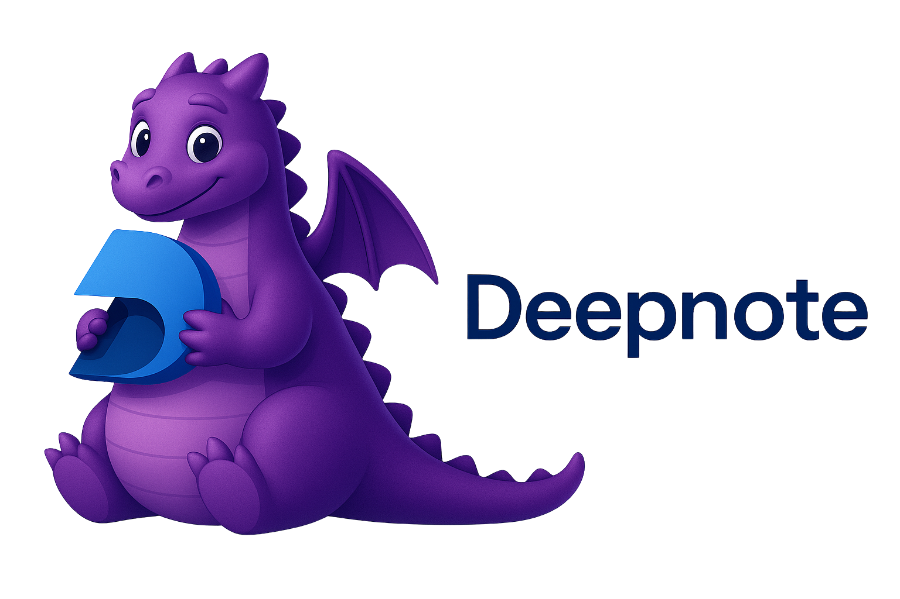

 <!--- This is just placeholder for deepnote + vscodde logo --->

[](https://github.com/deepnote/vscode-deepnote/actions/workflows/ci.yml)
[](https://codecov.io/gh/deepnote/vscode-deepnote)
[](https://opensource.org/licenses/MIT)
[](https://marketplace.visualstudio.com/items?itemName=Deepnote.vscode-deepnote)

A powerful [Visual Studio Code](https://code.visualstudio.com/) extension that brings [Deepnote](https://deepnote.com/) notebook capabilities directly into your favorite editor. Work with enhanced data science notebooks featuring SQL blocks, database integrations, and collaborative features - all within VS Code.

## 🚀 Features


### Enhanced Notebook Experience

Deepnote notebooks extend traditional Jupyter notebooks with powerful data science features:

- **🔢 Multiple Block Types** - Work with Python code, SQL queries, Markdown documentation, and specialized data science blocks
- **🔄 Seamless Language Switching** - Switch between Python and SQL within the same notebook without context switching
- **🗄️ Database Integrations** - Connect directly to PostgreSQL, BigQuery, Snowflake, and other data sources with secure credential management
- **⚡ Init Notebooks** - Automatically run initialization code (dependencies, environment setup) before notebook execution
- **📦 Automatic Requirements** - Generate `requirements.txt` from your project settings for reproducible environments
- **🎨 Rich Outputs** - View data visualizations, tables, and interactive outputs directly in VS Code
- **🔐 Secure Credential Storage** - Safely store and manage database credentials using VS Code's encrypted SecretStorage API

### Jupyter Kernel Support

Built on top of robust Jupyter infrastructure:

- **🐍 Python Kernel** - Full Python support with IPython features
- **🔌 Custom Deepnote Kernel** - Enhanced kernel with Deepnote-specific features and integrations
- **📊 Interactive Debugging** - Debug notebooks cell-by-cell with VS Code's debugger
- **🔄 Kernel Management** - Easy kernel selection, restart, and interrupt capabilities

### Project Management

- **📁 Project Explorer** - Browse and manage Deepnote projects directly from VS Code's sidebar
- **📓 Multi-Notebook Support** - Work with multiple notebooks from the same project
- **🔍 Quick Navigation** - Jump between notebooks and files with command palette integration
- **♻️ Auto-Refresh** - Automatic detection of project file changes

## 📋 Requirements

- **Visual Studio Code** 1.103.0 or higher
- **Python** 3.8 or higher (for running notebooks)
- **Node.js** 22.15.1 or higher (for development)

## 🎯 Getting Started

### Installation

1. Open VS Code
2. Press `Ctrl+P` / `Cmd+P` to open Quick Open
3. Type `ext install Deepnote.vscode-deepnote`
4. Press Enter

Or install from the [VS Code Marketplace](https://marketplace.visualstudio.com/items?itemName=Deepnote.vscode-deepnote)

### Opening Your First Deepnote Notebook

1. Open a folder containing `.deepnote` project files
2. Look for the Deepnote icon in the Activity Bar (sidebar)
3. Click on a notebook in the Deepnote Explorer to open it
4. Select a Python kernel when prompted
5. Start coding!

## 📖 Usage

### Command Palette

Open the Command Palette (`Cmd+Shift+P` on macOS, `Ctrl+Shift+P` on Windows/Linux) and type `Deepnote` to see all available commands:

| Command                            | Description                                        |
| ---------------------------------- | -------------------------------------------------- |
| `Deepnote: Refresh Explorer`       | Refresh the Deepnote project explorer              |
| `Deepnote: Open Notebook`          | Open a specific notebook from a Deepnote project   |
| `Deepnote: Open File`              | Open the raw .deepnote project file                |
| `Deepnote: Reveal in Explorer`     | Show active notebook information in the explorer   |
| `Deepnote: Manage Integrations`    | Configure database connections and credentials     |
| `Deepnote: New Project`            | Create a new Deepnote project                      |
| `Deepnote: Import Notebook`        | Import an existing notebook into your project      |
| `Notebook: Select Notebook Kernel` | Select or switch kernels within your notebook      |
| `Notebook: Change Cell Language`   | Change the language of the cell currently in focus |

### Database Integrations

Configure database connections for SQL blocks:

1. Open Command Palette
2. Run `Deepnote: Manage Integrations`
3. Add your database credentials (PostgreSQL, BigQuery, etc.)
4. Use SQL blocks in your notebooks with the configured integrations

Credentials are securely stored using VS Code's encrypted storage and never leave your machine.

### Working with SQL Blocks

SQL blocks allow you to query databases directly from your notebooks:

```sql
-- Query your PostgreSQL database
SELECT * FROM users WHERE created_at > '2024-01-01'
```

Results are displayed as interactive tables that you can explore and export.

## 🛠️ Development

Want to contribute? Check out our [Contributing Guide](CONTRIBUTING.md) for detailed setup instructions.

### Quick Start for Developers

```bash
# Clone the repository
git clone https://github.com/deepnote/vscode-deepnote.git
cd vscode-deepnote

# Install dependencies
npm install

# Setup pre-commit hooks
npm run setup-precommit-hook

# Compile and watch for changes
npm run watch

# Run tests
npm run test:unittests
```

See [CONTRIBUTING.md](CONTRIBUTING.md) for more details on:
- Setting up your development environment
- Running tests
- Building the extension
- Submitting pull requests

## 📚 Documentation

- **[Architecture](architecture.md)** - Technical architecture and design decisions
- **[Deepnote Kernel Implementation](DEEPNOTE_KERNEL_IMPLEMENTATION.md)** - Details on the custom Jupyter kernel
- **[Integrations & Credentials](INTEGRATIONS_CREDENTIALS.md)** - How database integrations work
- **[Contributing Guide](CONTRIBUTING.md)** - How to contribute to the project

## 🤝 Contributing

We welcome contributions! Please see our [Contributing Guide](CONTRIBUTING.md) for details on:

- Code of conduct
- Development setup
- Coding standards
- Pull request process
- Testing requirements

## 📄 License

This project is licensed under the MIT License - see the [LICENSE](LICENSE) file for details.

## 🐛 Issues & Support

- **Bug Reports**: [GitHub Issues](https://github.com/deepnote/vscode-deepnote/issues)
- **Feature Requests**: [GitHub Discussions](https://github.com/deepnote/vscode-deepnote/discussions)
- **Questions**: [GitHub Discussions](https://github.com/deepnote/vscode-deepnote/discussions)

## 🔗 Related Projects

- [Deepnote](https://deepnote.com/) - Collaborative data science notebook platform
- [Jupyter](https://jupyter.org/) - Open-source notebook ecosystem
- [VS Code Python Extension](https://marketplace.visualstudio.com/items?itemName=ms-python.python) - Python language support for VS Code

## 🌟 Keywords

`deepnote` `jupyter` `notebook` `data-science` `python` `sql` `database` `postgresql` `bigquery` `vscode-extension` `data-analysis` `machine-learning` `interactive-computing` `ipython` `jupyter-notebook` `collaborative-notebooks`

---

Made with ❤️ by the Deepnote team
