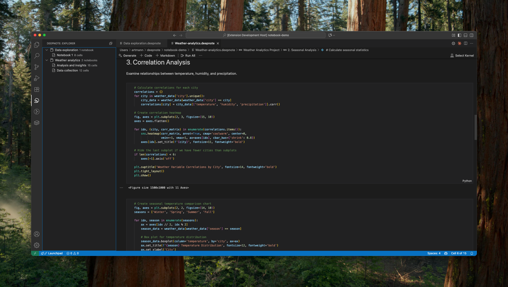

# Deepnote Extension for Visual Studio Code

A [Visual Studio Code](https://code.visualstudio.com/) extension that provides support for [Deepnote notebooks](https://deepnote.com/) directly within VS Code. This extension allows you to work with Deepnote notebooks in VS Code, bringing the rich data science capabilities of Deepnote to your favorite editor.

This extension allows you to work with Deepnote notebooks in VS Code. Deepnote notebooks provide enhanced data science capabilities beyond traditional Jupyter notebooks:

-   **More block types** - Choose from SQL blocks, chart blocks, and more specialized data science blocks
-   **Seamless language switching** - Switch between Python and SQL seamlessly within the same notebook
-   **Database integrations** - Connect directly to Postgres, Snowflake, BigQuery and more data sources
-   **Init notebooks** - Automatically runs initialization code (like dependency installation) before your notebooks execute
-   **Project requirements** - Automatically creates `requirements.txt` from your project settings for easy dependency management

## Useful commands

Open the Command Palette (Command+Shift+P on macOS and Ctrl+Shift+P on Windows/Linux) and type in one of the following commands:

| Command                            | Description                                        |
| ---------------------------------- | -------------------------------------------------- |
| `Deepnote: Refresh Explorer`       | Refresh the Deepnote project explorer              |
| `Deepnote: Open Notebook`          | Open a specific notebook from a Deepnote project   |
| `Deepnote: Open File`              | Open the raw .deepnote project file                |
| `Deepnote: Reveal in Explorer`     | Show active notebook information in the explorer   |
| `Notebook: Select Notebook Kernel` | Select or switch kernels within your notebook      |
| `Notebook: Change Cell Language`   | Change the language of the cell currently in focus |

To see all available Deepnote commands, open the Command Palette and type `Deepnote`.
