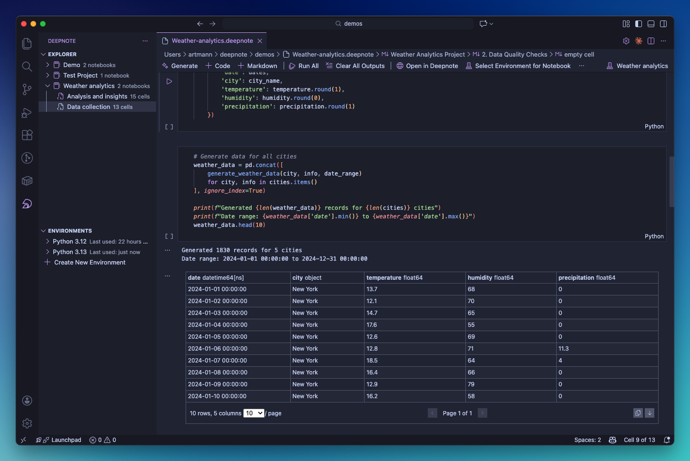

<div align="center">


[](https://github.com/deepnote/vscode-deepnote/actions/workflows/ci.yml)
[](https://codecov.io/gh/deepnote/vscode-deepnote)
[](https://marketplace.visualstudio.com/items?itemName=Deepnote.vscode-deepnote)

[Website](https://deepnote.com/?utm_source=github&utm_medium=github&utm_campaign=github&utm_content=readme_main) • [Docs](https://deepnote.com/docs?utm_source=github&utm_medium=github&utm_campaign=github&utm_content=readme_main) • [Changelog](https://deepnote.com/changelog?utm_source=github&utm_medium=github&utm_campaign=github&utm_content=readme_main) • [X](https://x.com/DeepnoteHQ) • [Examples](https://deepnote.com/explore?utm_source=github&utm_medium=github&utm_campaign=github&utm_content=readme_main) • [Community](https://github.com/deepnote/deepnote/discussions)

</div>

# Deepnote in VS Code, Cursor, Windsurf, and Antigravity

A powerful [Visual Studio Code](https://marketplace.visualstudio.com/items?itemName=Deepnote.vscode-deepnote), [Cursor](https://open-vsx.org/extension/Deepnote/vscode-deepnote), [Windsurf](https://open-vsx.org/extension/Deepnote/vscode-deepnote), and [Antigravity](https://open-vsx.org/extension/Deepnote/vscode-deepnote) extension that brings [Deepnote](https://deepnote.com/) notebook capabilities directly into your favorite editor. Work with sleek AI notebooks featuring SQL blocks, database integrations, and reactive blocks - all within your IDE.




Run Deepnote locally inside your IDE and unlock the next generation of data workflows:

- **Rich block types:** Combine Python, Markdown, data visualizations, tables, and more — all in one place
- **SQL blocks:** Run SQL queries out of the box, no extensions needed
- **Native database connections:** Securely connect to Snowflake, BigQuery, Postgres, and 60+ other sources via VS Code’s encrypted SecretStorage API
- **Init notebooks:** Auto-run setup code (dependencies, env setup) before execution
- **Smart requirements:** Generate `requirements.txt` automatically for reproducible runs
- **Deepnote kernel:** Fully `.ipynb` compatible, tuned for modern data workflows
- **Cloud collaboration:** Switch between local VS Code and Deepnote Cloud to collaborate live on the same file with your team

## Getting started

1. Open the extensions tab and Search for Deepnote
2. Or alternatively, press `Cmd+P` or `Ctrl+P` to open the command palette.
3. Type `ext install Deepnote.vscode-deepnote`
4. Press Enter

Or install from the [VS Code Marketplace](https://marketplace.visualstudio.com/items?itemName=Deepnote.vscode-deepnote)

### Requirements

- **Visual Studio Code** 1.95.0 or higher
- **Python** 3.10 or higher (for running notebooks)

### Opening your first Deepnote notebook

1. Open a folder containing `.deepnote` project files
2. Look for the Deepnote icon in the Activity Bar (sidebar)
3. Click on a notebook in the Deepnote Explorer to open it
4. Select a Python kernel when prompted
5. Start coding!

## Usage

### Command palette

Open the Command Palette (`Cmd+Shift+P` or `Ctrl+Shift+P`) and type `Deepnote` to see all available commands:

| Command                            | Description                                        |
| ---------------------------------- | -------------------------------------------------- |
| `Deepnote: Refresh Explorer`       | Refresh the Deepnote project explorer              |
| `Deepnote: Open Notebook`          | Open a specific notebook from a Deepnote project   |
| `Deepnote: Open File`              | Open the raw .deepnote project file                |
| `Deepnote: Reveal in Explorer`     | Show active notebook information in the explorer   |
| `Deepnote: Manage Integrations`    | Configure database connections and credentials     |
| `Deepnote: New Project`            | Create a new Deepnote project                      |
| `Deepnote: Import Notebook`        | Import an existing notebook into your project      |
| `Notebook: Select Notebook Kernel` | Select or switch kernels within your notebook      |
| `Notebook: Change Cell Language`   | Change the language of the cell currently in focus |

### Database integrations

Configure database connections for SQL blocks:

1. Open Command Palette
2. Run `Deepnote: Manage Integrations`
3. Add your database credentials (PostgreSQL, BigQuery, etc.)
4. Use SQL blocks in your notebooks with the configured integrations

Credentials are securely stored using VS Code's encrypted storage and never leave your machine.

### Working with SQL Blocks

SQL blocks allow you to query databases directly from your notebooks:

```sql
-- Query your PostgreSQL database
SELECT * FROM users WHERE created_at > '2024-01-01'
```

Results are displayed as interactive tables that you can explore and export.

## Need help?

- Join our [Community](https://github.com/deepnote/deepnote/discussions)!
- Open an [Issue](https://github.com/deepnote/vscode-deepnote/issues) for bug reports or feature requests
- Have a look at [Architecture](architecture.md) for technical and design decisions
- Visit [Deepnote kernel implementation](DEEPNOTE_KERNEL_IMPLEMENTATION.md) for the custom Jupyter kernel
- Learn how database integrations work in [Integrations & credentials](INTEGRATIONS_CREDENTIALS.md)

## Contributing

Want to contribute? Check out our [Contributing guide](CONTRIBUTING.md) for detailed setup instructions.

---

<div align="center">

Built with 💙

</div>
